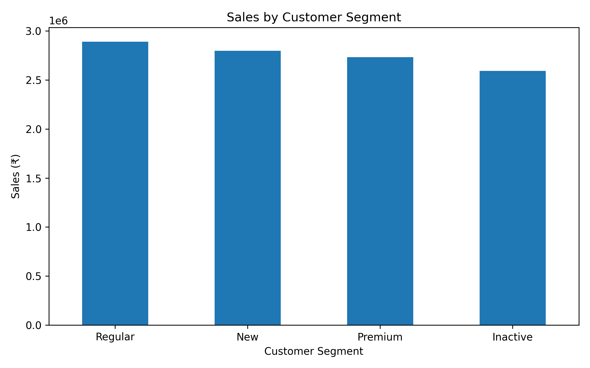
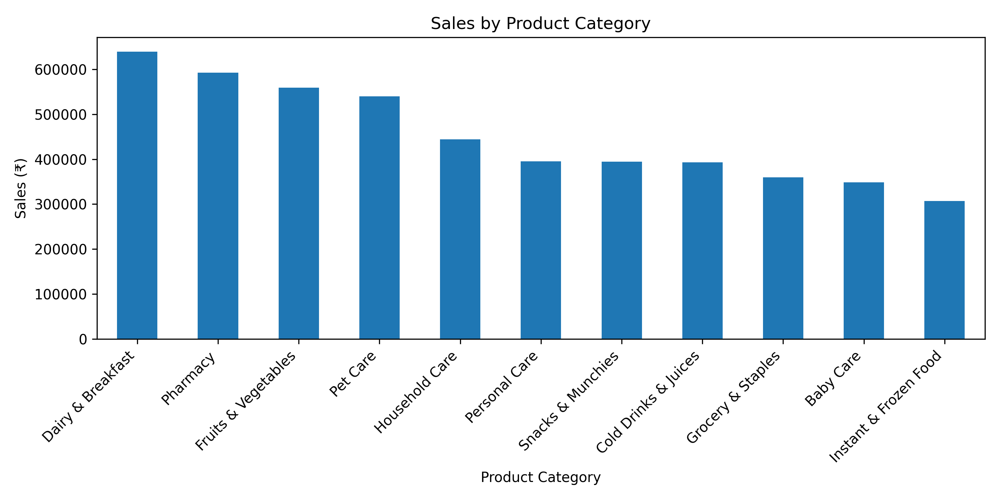
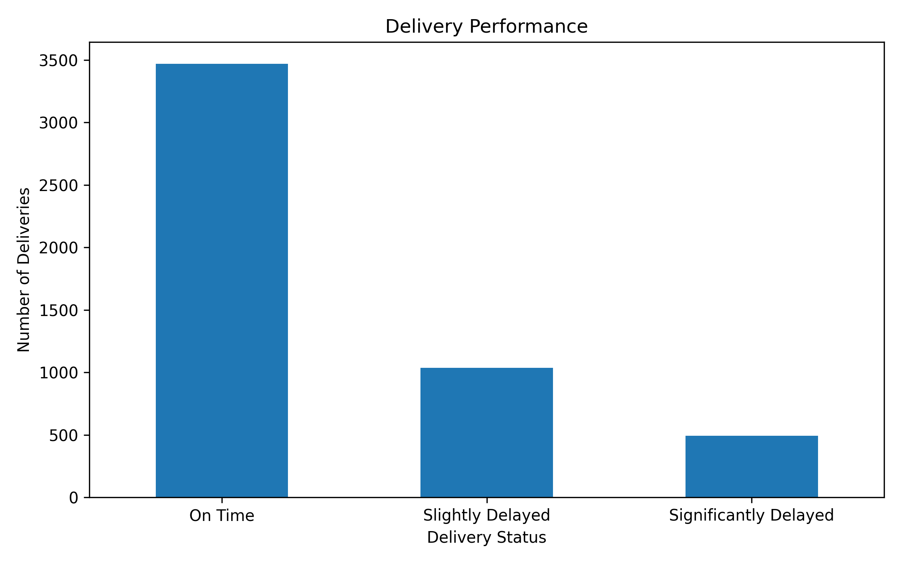
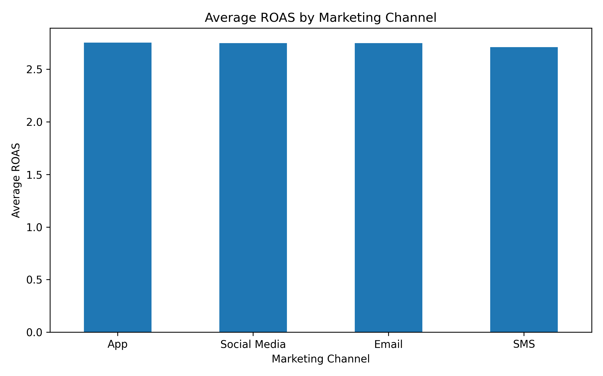
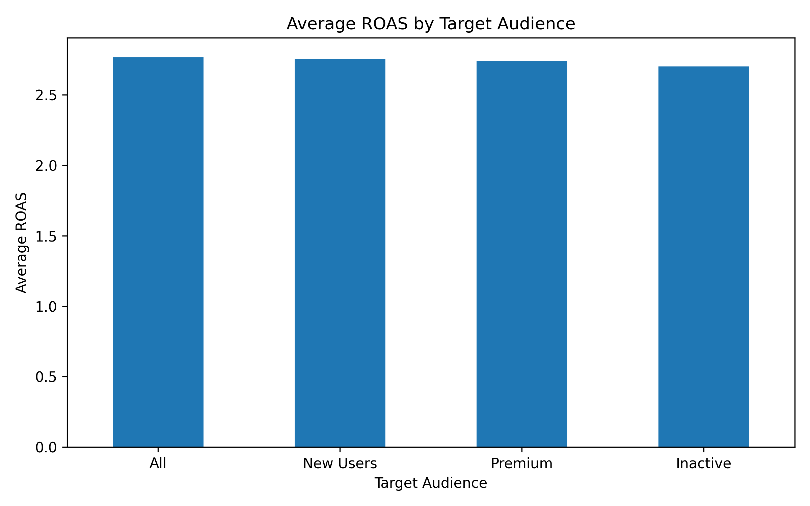
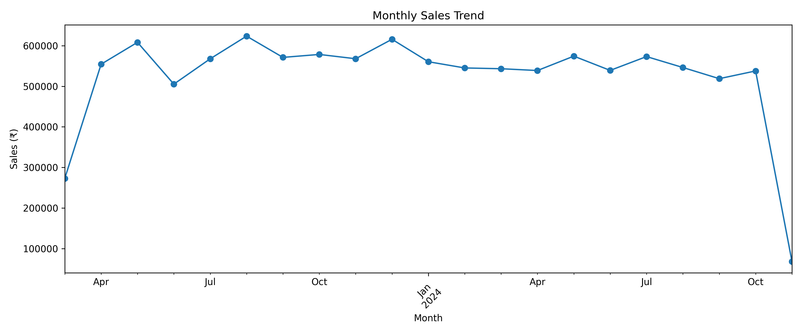
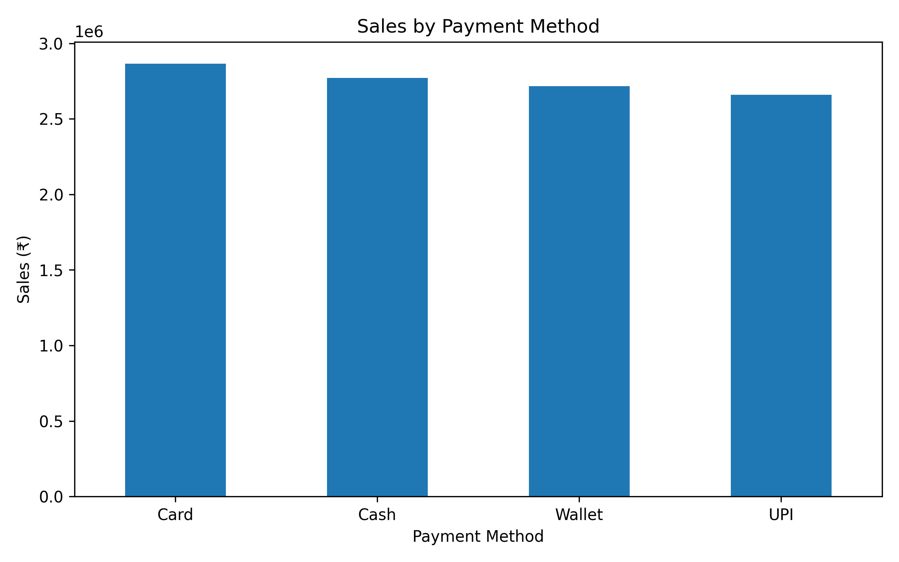

# Blinkit Business Performance Analysis

A business analytics project analyzing Blinkit's sales, customers, products, delivery performance, and marketing data using Python and Exploratory Data Analysis (EDA).

## 📌 Project Overview

This project analyzes multiple Blinkit business datasets to identify sales trends, customer behavior, product performance, delivery efficiency, and marketing performance.

The analysis focuses on converting raw business data into meaningful insights and actionable business recommendations.

## 🎯 Objectives

- Analyze overall sales performance
- Understand customer purchasing behavior
- Identify high-performing products and categories
- Analyze delivery performance
- Evaluate marketing performance
- Identify important business trends
- Provide data-driven business recommendations

## 🛠️ Tools & Technologies

- Python
- Pandas
- NumPy
- Matplotlib
- Seaborn
- Google Colab
- Google Drive
- GitHub

## 📂 Datasets

The project uses six datasets:

- Orders
- Order Items
- Products
- Customers
- Delivery Performance
- Marketing Performance

## 📊 Key Findings

- Total sales analyzed: **₹1,10,09,308.50**
- Total orders: **5,000**
- Unique customers: **2,172**
- Average order value: **₹2,201.86**
- Delayed deliveries: **30.60%**
- Highest-sales customer segment: **Regular customers**
- Highest average order value: **New customers**
- Highest-sales product category: **Dairy & Breakfast**
- Total marketing spend: **₹1,63,19,838.24**
- Marketing revenue generated: **₹3,21,93,407.37**
- Overall marketing ROAS: **1.97**

## 💡 Business Recommendations

1. Focus on retaining Regular customers because they generated the highest total sales.
2. Develop strategies to increase repeat purchases from New customers, who showed the highest average order value.
3. Maintain strong inventory and availability for high-performing categories such as Dairy & Breakfast, Pharmacy, and Fruits & Vegetables.
4. Investigate traffic-related delivery delays and explore operational measures to improve delivery reliability.
5. Monitor marketing channel performance and optimize campaigns using ROAS and revenue generated as key performance indicators.

## 📓 Project Notebook

The complete analysis and Python code are available in:

`notebooks/Blinkit_Business_Performance_Analysis.ipynb`

## 📈 Project Type

**Business Analytics | Exploratory Data Analysis | Data Visualization**

## 📊 Visualizations

### Sales by Customer Segment

### Sales by Product Category

### Delivery Performance

### Marketing Channel ROAS

### Marketing Audience ROAS

### Monthly Sales Trend

### Sales by Payment Method

